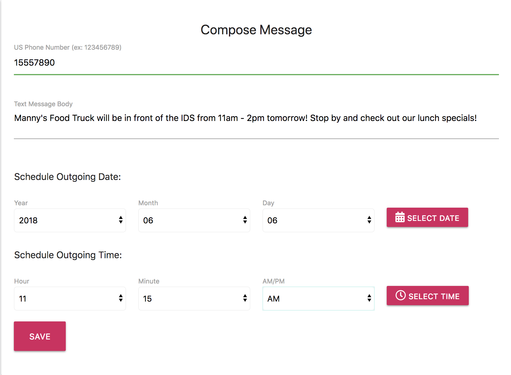

<!--  -->

 ### Created during week 16 of Trilogy Bootcamp. REACH is an app allowing the user to send a text at a pre-determined time and date of their choice. 
###<a href="https://app.xtensio.com/folio/s5ls38nj">Personal Use Case</a>
###<a href="https://app.xtensio.com/folio/s5ls38nj">Business  Use Case</a>

Features: 

###Reach is a full-stack app incorporating:
 

##SCREENSHOTS
 
Compose a message

 
Choose a date and time

 
View your pending outbox

 
Edit pending texts

> Authors
* Brandon Vreeman
* Majid 
* Saundra
* Thom 

Get out there and start texting! :iphone: 

