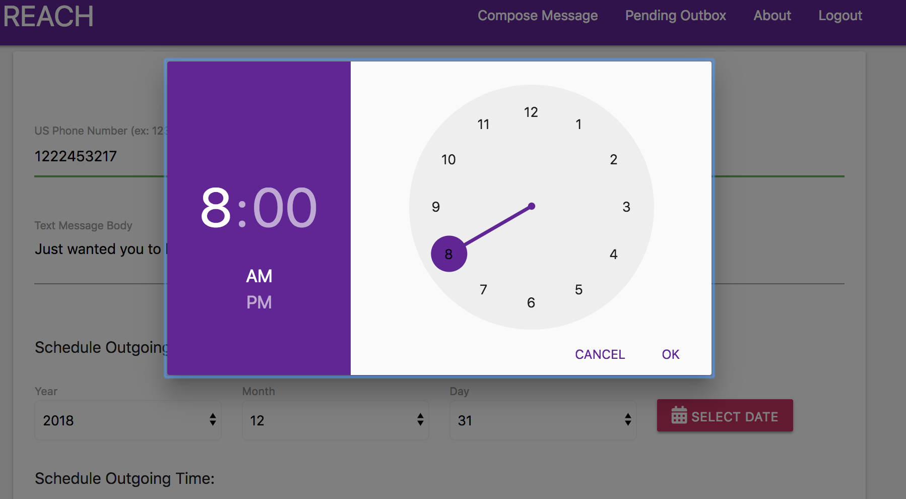
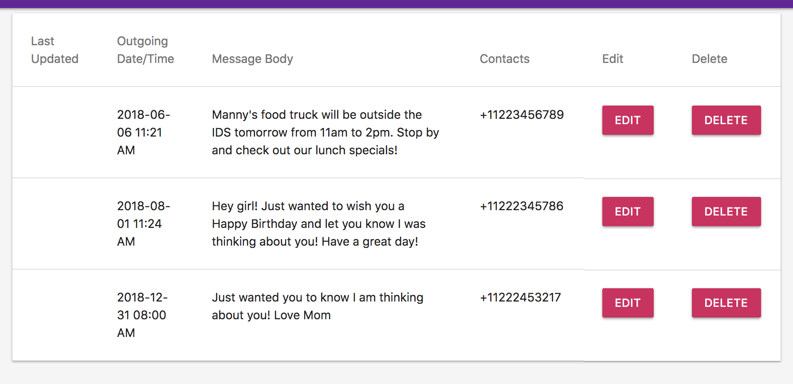

<!--  -->

 ## Created during week 16 of Trilogy Bootcamp. REACH is an app allowing the user to send a text at a pre-determined time and date of their choice. 

### Link: <a href="https://app.xtensio.com/folio/s5ls38nj">Personal Use Case</a>
### Link: <a href="https://app.xtensio.com/folio/s5ls38nj">Business  Use Case</a>

Features: 

#This Full Stack App Uses: 
 

#SCREENSHOTS
 

 

 

 

> Authors
* Brandon Vreeman
* Majid 
* Saundra
* Thom 

Get out there and start texting! :iphone: 

